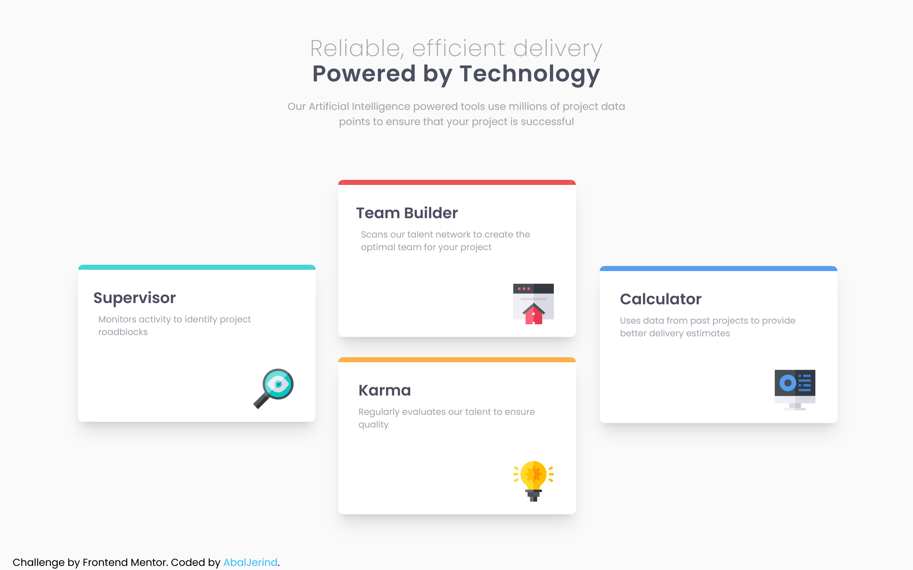
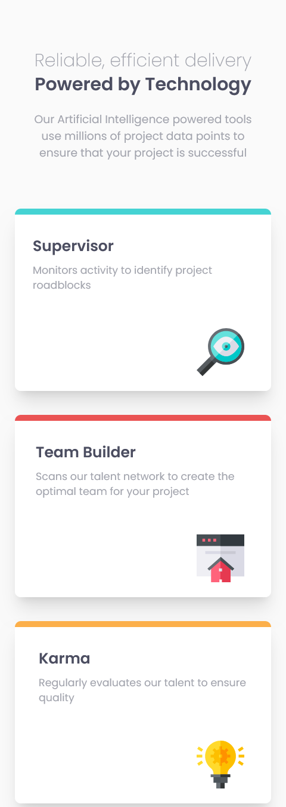
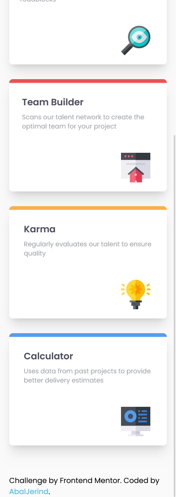

# Frontend Mentor - Four card feature section solution

This is a solution to the [Four card feature section challenge on Frontend Mentor](https://www.frontendmentor.io/challenges/four-card-feature-section-weK1eFYK). Frontend Mentor challenges help you improve your coding skills by building realistic projects.

## Table of contents

- [Overview](#overview)
  - [The challenge](#the-challenge)
  - [Screenshot](#screenshot)
  - [Links](#links)
- [My process](#my-process)
  - [Built with](#built-with)
  - [What I learned](#what-i-learned)
  - [Useful resources](#useful-resources)
- [Author](#author)
- [Acknowledgments](#acknowledgments)

## Overview

### The challenge

Users should be able to:

- View the optimal layout for the site depending on their device's screen size

### Screenshot

- Desktop version.
  

- Mobile version.
  
  

### Links

- Solution URL: [Source code on Github](https://github.com/Abaljerind/four-card-feature)
- Live Site URL: [Four Card Feature Section](https://four-card-feature-git-main-abaljerind.vercel.app/)

## My process

### Built with

- Semantic HTML5 markup
- [TailwindCSS](https://tailwindcss.com/) - For styles

### What I learned

In this challenge is the first time i use display grid using TailwindCSS and it is actually feel easy, but still i had to make a little adjustment so that the code works perfectly. Here it is the codes;

```html
<h1>Some HTML & CSS inline code I'm proud of</h1>
```

```html
<div class="cards sm:mt-12 sm:grid sm:grid-cols-2 sm:gap-5 lg:ml-14 lg:grid lg:grid-cols-3 lg:gap-7 2xl:ml-20">
  <div class="mt-16 rounded-lg border-t-[0.5rem] border-t-cyan bg-white shadow-xl sm:mt-8 sm:place-self-start lg:ml-10 lg:mt-5 lg:w-[375px] lg:place-self-center 2xl:ml-20"></div>
</div>
```

### Useful resources

- [TailwindCSS](https://tailwindcss.com/) - This helped me to do the styling more easy. I really liked this tailwind css and will use it going forward.
- [Vercel](https://vercel.com) - This is an amazing website which helped me to upload my website into the internet. I'd recommend it to anyone still learning to use this website.

## Author

- Website - [AbalJerind](https://four-card-feature-git-main-abaljerind.vercel.app/)
- Frontend Mentor - [@Abaljerind](https://www.frontendmentor.io/profile/Abaljerind)

## Acknowledgments

I want to thank me for believing in me, I want to thank me for doing all this hard work. I wanna thank me for having no days off. I wanna thank me for never quitting. I wanna thank me for being me at all times.
